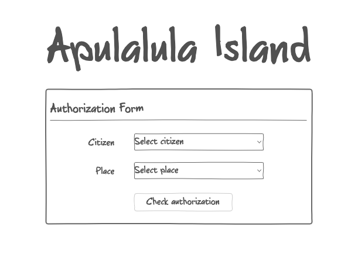
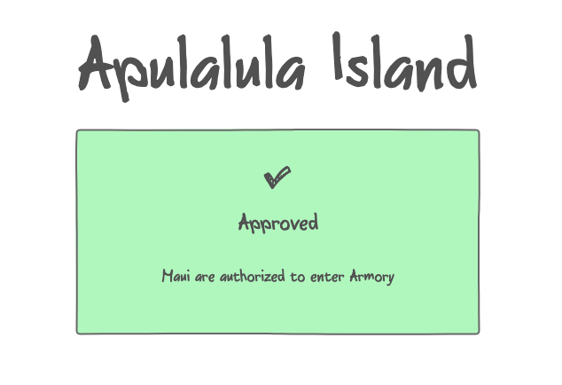
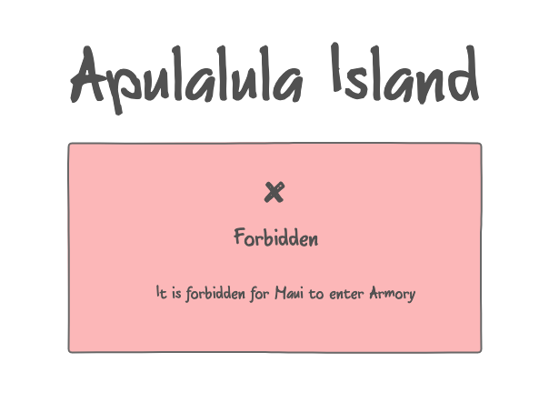

# Roles-app

Maui was requested by the gods to guard Apulalula Island, and allow entrance to important places only for those worthy. Maui is good at fightin’, slashin’ & smashin’, but has some memory problems, and struggles to remember all places each island citizen is allowed to visit, so he wrote all his knowledge in storage and created an API - [https://apulalula-api.up.railway.app/api](https://apulalula-api.up.railway.app/api#/default/AppController_roles).

He also remembers that some citizens have important roles that grant them extra worthiness and give them access to more places, and some roles may even have sub-roles related to them that grant even more worthiness.

Hina and Sina live on Apulalula island and work on the island's border control office. They will need to use Maui's knowledge for allowing the citizens to walk on the island.

Maui already started the work and created this boilerplate, but had more urgent godly matters to attend. So you've been asked to finish the app Hina and Sina can use in order to determine if a citizen has access to visit a certain place based on the information Maui remembered. The app should be choosing from the existing Citizens And Places that exist in Maui knowledge.

Divide your work into two steps:

## First step (~45 minutes)

Finish writing the function `isAllowed` that located in `/src/isAllowed.ts` file. Maui wrote some tests to help you make sure your `isAllowed` function works. The tests are in `/src/isAllowed.test.ts` file.

To run the test cases, use the command `yarn test`.

## Second step (~1 hour)

Create a form for Hina & Sina to check the citizens. Maui created some mockup designs and he expects the app to look something like that:

Expected features:

- Should have 2 input selects: Citizens and Places the citizen wants to enter.
- Should have a `Check authorization` button.
- After clicking `Check authorization`, expected display `Approved / Forbidden Entrance`.

# Instructions

To set up the project on your machine, follow these steps:

1. Clone the repository to your local machine using git clone.
2. Navigate to the root directory of the project.
3. Run `yarn install` to install the project dependencies.
4. Run `yarn dev` to start the development server and view the app in your browser.

### Notes

1. You have ~2 hours.
2. Feel free to use MUI or any other component library you feel comfortable with.
3. Make sure your code is runnable.
4. If you have any questions, feel free to ask.
5. Good Luck :)
